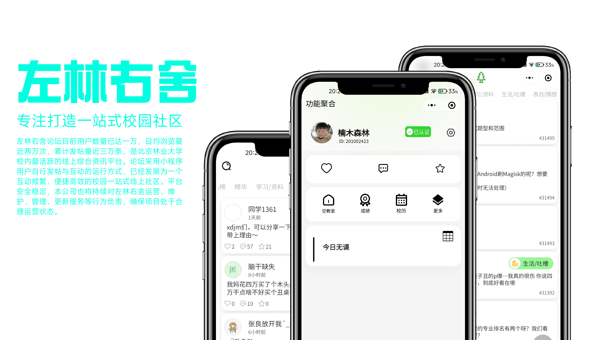
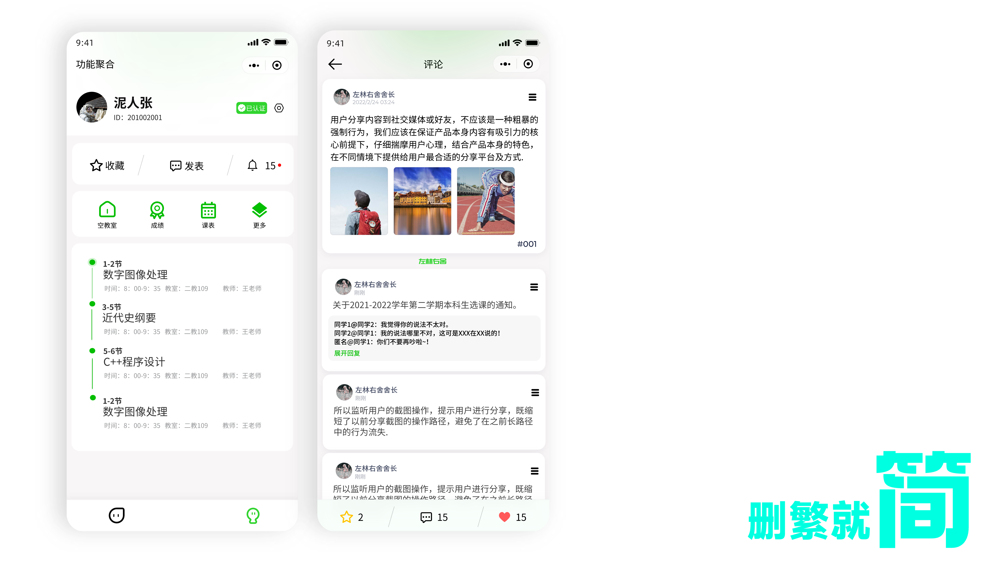
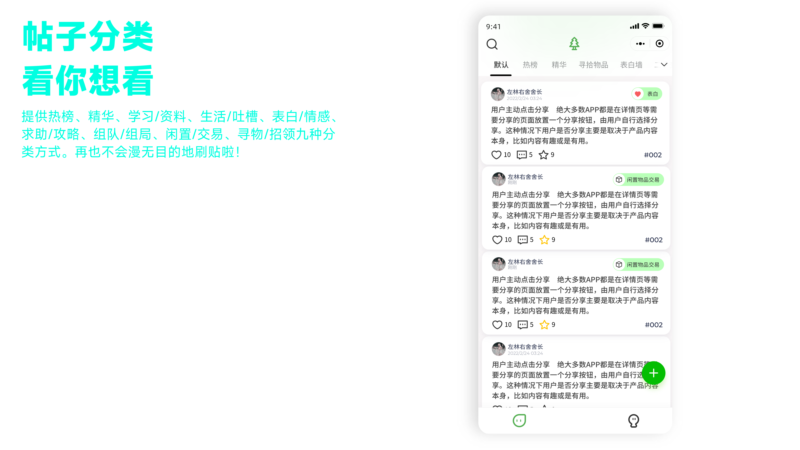
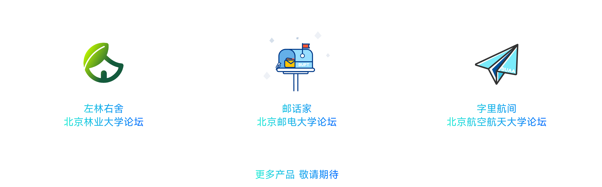
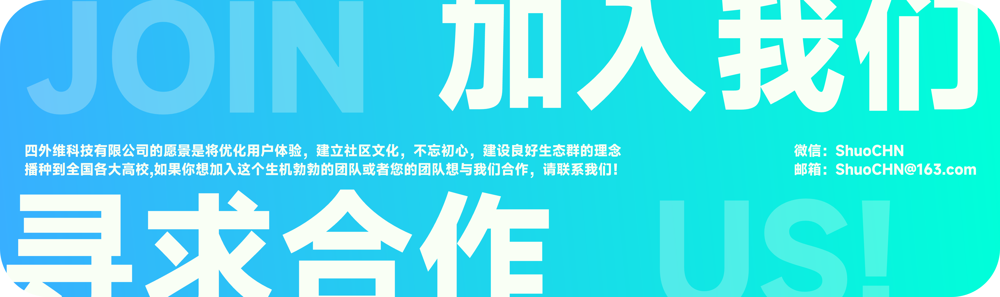

::: center
  # 科技新星 大有可维
  ### 我们致力于打造校园社交的“平行时空”
  ### 在这里，每个人都能大胆发声，每个想法都将被看见。
  ### 在这里，在这个熟悉而陌生的环境里，你将发现新的可能，探索新的方向
   
   
   

  
  
  

   

  ### 产品矩阵

  

  
:::

<!-- 设置circle透明度为0.5 -->
<html>

<!-- 

 -->

</html>

